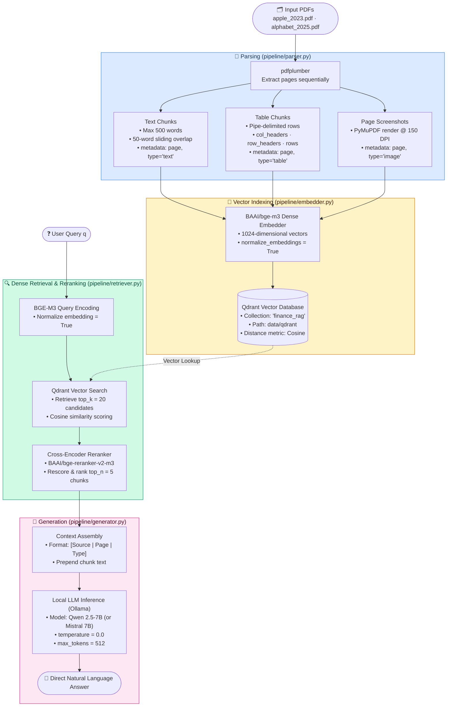

# 🏛️ System Architectures & Pipeline Workflows

This document provides detailed architecture specifications, component breakdowns, and data flow diagrams for all three Financial RAG pipelines evaluated in this project.

---

## 📑 Table of Contents
1. [BasicRAG (Flat Baseline)](#1-basicrag--flat-baseline)
2. [HierFinRAG (Hierarchical Symbolic-Neural Fusion)](#2-hierfinrag--hierarchical-symbolic-neural-fusion)
3. [TableTransformerRAG (Vision-Based DETR Detection)](#3-tabletransformerrag--vision-based-detr-detection)
4. [Comparative Architectural Highlights](#4-comparative-architectural-highlights)

---

## 1. BasicRAG — Flat Baseline

The baseline system implements a standard, single-stage dense retrieval RAG pipeline without hierarchical document structure or symbolic execution.



---

## 2. HierFinRAG — Hierarchical Symbolic-Neural Fusion

HierFinRAG solves the structural and mathematical limitations of flat RAG using a 4-level document tree, 3-level hybrid retrieval (BM25 + BGE-M3 + RRF), and a deterministic symbolic DSL calculator.

```mermaid
flowchart TD
    IN([🗂️ Input PDFs\napple_2023.pdf · alphabet_2025.pdf])

    subgraph PARSE["📄 4-Level Hierarchical Parsing  (pipeline/parser.py)"]
        P1["pdfplumber Page Parser"]
        P1 --> SEC["Level 1: Section Nodes\n• Detected via _is_header()\n• Heuristics: short, title-case, no trailing period\n• Fallback: Promote text chunks if count = 0"]
        P1 --> TBL["Level 2a: Table Chunks\n• col_headers · row_headers · rows\n• parent_id → Section chunk_id"]
        P1 --> TXT["Level 2b: Text Paragraphs\n• Max 400 words per chunk\n• parent_id → Section chunk_id"]
        TBL --> CEL["Level 3: Cell Chunks  (Key Innovation)\n• Format: 'row_header | col_header: value'\n• 1 chunk per (row × col) intersection\n• parent_id → Table chunk_id"]
        SEC & TBL & TXT & CEL --> GRF["Document Tree Graph\n• chunk_id (UUID), parent_id, children_ids\n• Bi-directional navigation across document levels"]
    end

    IN --> P1

    subgraph EMBED["🔢 Vector Storage  (pipeline/embedder.py)"]
        EM["BAAI/bge-m3  (dim=1024)\nQdrant collection: 'hier_finance_rag'\nSections, Text, Tables, and Cells indexed separately"]
    end

    GRF --> EM

    QUERY([❓ User Query q]) --> RT1

    subgraph ROUTE["🧭 Two-Stage Intent Router  (pipeline/router.py)"]
        RT1["Stage 1: Weighted Keyword Scoring\n• Numerical: change, growth, ratio, increase, decrease\n• Lookup: what, which, when, how much, revenue\n• Comparison: compare, higher, lower, vs, between\n• Summarization: describe, explain, overview"]
        RT1 --> RTC{Score > 0\n& Not Tied?}
        RTC -->|Yes| INTENT["Classified Intent:\nNumerical / Lookup / Comparison / Summarization"]
        RTC -->|No — Fallback| RT2["Stage 2: Ollama Single-Token Classifier\n• Prompt: classify into 4 categories\n• temperature = 0.0, max_tokens = 1"]
        RT2 --> INTENT
    end

    INTENT --> L1

    subgraph RETRIEVE["🔍 Three-Level Hybrid Retrieval  (pipeline/retriever.py)"]
        L1["Level 1: Metadata Filter & Query Expansion\n• Source filter: target PDF only\n• Append 4-digit year tokens r'\\b(20\\d{2})\\b'\n• Search over Section nodes only"]
        L1 --> L2["Level 2: Hybrid BM25 + Dense Search + RRF\n• BM25Okapi sparse retrieval over Section children\n• BGE-M3 dense retrieval over Section children\n• Reciprocal Rank Fusion (k=60):\n  RRF(d) = Σ 1 / (60 + rank_i(d))"]
        L2 --> CE["Cross-Encoder Reranker\n• BAAI/bge-reranker-v2-m3\n• Rescores top candidates for relevance"]
        CE --> L3["Level 3: Cell Dense Search\n• Dense search over type='cell' chunks\n• Isolates exact table coordinate for Numerical QA\n• Cell score boost: +3.0 over prose"]
    end

    EM -.->|Vector Lookup| L1
    L3 --> GENC

    subgraph GEN["⚙️ Symbolic-Neural Fusion Generator  (pipeline/generator.py)"]
        GENC{Classified\nIntent?}
        
        GENC -->|Lookup / Summarization| NR["Neural Path\n• Direct LLM generation\n• Context formatted with section lineage\n• Qwen 2.5-7B (temp=0.0)"]
        
        GENC -->|Numerical| SR["Symbolic Path (Deterministic)\n1. LLM synthesizes FinQA DSL program:\n   percentage_change(old, new)\n   divide(subtract(a, b), b)\n   add, subtract, multiply, divide\n2. SymbolicCalculator executes via numexpr\n   (nested depth ≤ 15, no arbitrary eval())\n3. LLM narrates computed numeric result"]
        
        GENC -->|Comparison| HR["Hybrid Path (Multi-Step)\n1. LLM generates step-by-step reasoning plan\n2. SymbolicCalculator executes each &lt;step&gt;\n3. LLM synthesizes comparison across computed values\n4. 2nd call extracts direct categorical answer"]
        
        NR & SR & HR --> AT
    end

    subgraph ATTR["📎 Grounded Attribution  (pipeline/attribution.py)"]
        AT["• Supporting Cell Extraction\n• Supporting Sentence Extraction\n• Calibrated Confidence Score\n• Attribution Map: Answer claims ↔ source chunks"]
    end

    AT --> OUT([✅ Answer + Calibrated Confidence + Evidence Attribution])

    style PARSE fill:#dbeafe,stroke:#3b82f6,color:#1e3a5f
    style EMBED fill:#fef3c7,stroke:#d97706,color:#451a03
    style ROUTE fill:#ede9fe,stroke:#7c3aed,color:#2e1065
    style RETRIEVE fill:#d1fae5,stroke:#059669,color:#064e3b
    style GEN fill:#fce7f3,stroke:#db2777,color:#500724
    style ATTR fill:#fee2e2,stroke:#dc2626,color:#450a0a
```



---

## 3. TableTransformerRAG — Vision-Based DETR Detection

TableTransformerRAG replaces heuristic PDF parsing with deep visual table detection using Microsoft's Table Transformer (TATR), maps visual crops to native PDF coordinate space, and implements two-pass zero-shot extraction.

```mermaid
flowchart TD
    IN([🗂️ Input PDFs\napple_2023.pdf · alphabet_2025.pdf])

    subgraph VPARSE["🖼️ Vision Table Parser  (pipeline/parser.py)"]
        V1["PyMuPDF (fitz) High-Res Render\n• 300 DPI RGB page image\n• matrix = fitz.Matrix(300/72, 300/72)"]
        V1 --> V2["TATR Table Detection\n• Model: microsoft/table-transformer-detection\n• DETR architecture\n• Confidence threshold = 0.85\n• Output: Table bounding boxes in page-pixel coordinates"]
        V2 --> V3["Table Region Crop & Padding\n• 5px bounding box padding\n• Extracted PIL sub-image per table"]
        V3 --> V4["TATR Structure Recognition\n• Model: microsoft/table-transformer-structure-recognition-v1.1-all\n• Output: Rows, Columns, Header bboxes in crop-pixel coordinates"]
        V4 --> V5["Crop-to-PDF Coordinate Mapping\n• x_pdf = x1 + (x_px / w_crop) × (x2 - x1)\n• y_pdf = y1 + (y_px / h_crop) × (y2 - y1)\n• Maps pixel bboxes to PDF points (x1, y1, x2, y2)"]
        V5 --> V6["Native PDF Word Containment Matching\n• Extract native PDF word objects via fitz\n• Test word center-point: (wx, wy) ∈ Cell_PDF_Rect\n• Zero OCR noise — preserves original character encoding"]
        
        V6 --> TC["Table Chunks (col/row headers, structured rows)"]
        TC --> CC["Cell Chunks (row | col: value)"]
        
        V1 --> NT["Non-Table Text Recovery\n• Filter out words inside table bboxes\n• Group remaining words by y-proximity into lines\n• Assemble paragraphs (max 500 words)"]
    end

    IN --> V1

    subgraph POST["🔁 Post-Processing & Normalization"]
        PP["• Row-Signature Deduplication (hash-based)\n• Heuristic Header Promotion\n• Alphabet Section Fallback (promotes text to sections if count=0)"]
    end

    TC & CC & NT --> PP

    subgraph EMBED["🔢 Vector Storage  (pipeline/embedder.py)"]
        EM["BAAI/bge-m3 (dim=1024)\nQdrant collection: 'tatr_finance_rag'"]
    end

    PP --> EM

    QUERY([❓ User Query q]) --> ROUTE

    subgraph ROUTE["🧭 Intent Router  (pipeline/router.py)"]
        ROUTE["Two-Stage Classifier:\n1. Keyword rule scoring\n2. Single-token LLM fallback\n→ Numerical / Lookup / Comparison / Summarization"]
    end

    ROUTE --> RL1

    subgraph RETRIEVE["🔍 Structure-Aware Retrieval  (pipeline/retriever.py)"]
        RL1["Level 1: Source filtering & year expansion"]
        RL1 --> RL2["Level 2: BM25 + BGE-M3 + RRF (k=60)\n• Injects section text payload into candidate chunks\n• Enriches contextual coherence for financial rows"]
        RL2 --> RCE["Cross-Encoder Reranker\n• BAAI/bge-reranker-v2-m3"]
        RCE --> RL3["Level 3: Cell Dense Search & Context Sizing\n• Cell relevance boost: +3.0\n• Intent-conditioned context sizing:\n  Lookup: top_n = 10\n  Summarization: top_n = 15\n  Numerical: top_n = 10 with cell boost"]
    end

    EM -.->|Vector Lookup| RL1
    RL3 --> GENV

    subgraph GEN["⚙️ Generator & Two-Pass Extraction  (pipeline/generator.py)"]
        GENV{Intent?}
        
        GENV -->|Lookup| TP["Two-Pass Extraction (Key Fix)\nPass 1: Initial generation from context\nPass 2: If answer length > 50 characters:\n        Zero-shot value extraction call:\n        'Give ONLY the exact value. Max 10 words.'\n(Lookup Accuracy: 6.0% → 54.0%  +800% gain)"]
        
        GENV -->|Numerical| SP["Symbolic Path\nFinQA DSL synthesis → SymbolicCalculator (numexpr)"]
        
        GENV -->|Comparison| HP["Hybrid Path\nMulti-step calculation plan + execution + categorical answer"]
        
        GENV -->|Summarization| NP["Neural Path\nSynthesize full overview (top_n = 15)"]
        
        TP & SP & HP & NP --> AT2
    end

    subgraph ATTR2["📎 Attribution  (pipeline/attribution.py)"]
        AT2["Supporting Cells · Supporting Sentences\nConfidence Calibration · Attribution Mapping"]
    end

    AT2 --> OUT([✅ Final Answer + Verified Evidence])

    style VPARSE fill:#dbeafe,stroke:#3b82f6,color:#1e3a5f
    style POST fill:#f3f4f6,stroke:#6b7280,color:#111827
    style EMBED fill:#fef3c7,stroke:#d97706,color:#451a03
    style ROUTE fill:#ede9fe,stroke:#7c3aed,color:#2e1065
    style RETRIEVE fill:#d1fae5,stroke:#059669,color:#064e3b
    style GEN fill:#fce7f3,stroke:#db2777,color:#500724
    style ATTR2 fill:#fee2e2,stroke:#dc2626,color:#450a0a
```

---

## 4. Comparative Architectural Highlights

| Architectural Dimension | BasicRAG | HierFinRAG | TableTransformerRAG |
|---|---|---|---|
| **Document Representation** | Flat chunks | 4-Level Graph (Section-Text-Table-Cell) | 4-Level Graph (Visual TATR + Section-Cell) |
| **Table Detection** | Rule-based `pdfplumber` | Structural `pdfplumber` | Vision DETR (`microsoft/table-transformer`) |
| **Coordinate Space** | None | Text-flow heuristic | 300-DPI crop to PDF-point affine mapping |
| **Retrieval Strategy** | Single-pass Dense | 3-Level Hybrid (BM25 + Dense + RRF $k=60$) | 3-Level Hybrid + Section Payload Injection |
| **Arithmetic Execution** | Direct LLM (prone to hallucination) | FinQA DSL + `numexpr` Symbolic Engine | FinQA DSL + `numexpr` Symbolic Engine |
| **Lookup Post-Processing** | Single-pass generation | Single-pass generation | Two-Pass Zero-Shot Extraction |
| **Context Sizing** | Static $k=5$ | Intent-routed ($n=10 \sim 15$) | Intent-Conditioned + Cell Boost (+3.0) |
| **Execution Accuracy (EM)** | **3.0%** | **40.0%** | **48.2%** |
| **Retrieval Recall@10** | 80.3% | **93.4%** | 89.7% |
