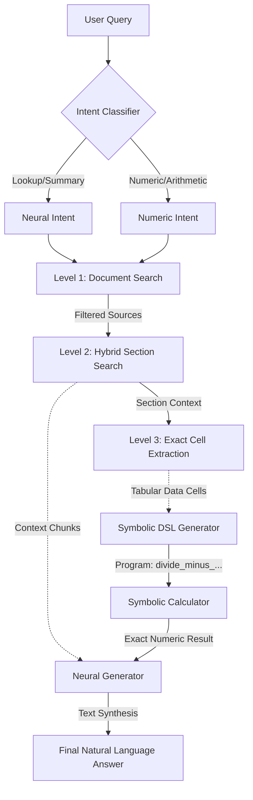

# HierFinRAG: Hierarchical Financial Retrieval-Augmented Generation

HierFinRAG is an advanced AI pipeline built to answer complex, numerically-intensive questions over large corporate financial disclosures (10-Ks, 10-Qs). Standard RAG architectures often fail on financial data because they retrieve isolated text chunks that lack structural context, causing models to hallucinate numeric values or misunderstand tabular formats. 

This project solves the "needle-in-a-haystack" numeric retrieval problem through a **three-level hierarchical retrieval** architecture combined with **symbolic-neural fusion**.

## How It Works

The pipeline is split into an indexing phase (`embedder.py`/`parser.py`) and a querying phase (`retriever.py`/`generator.py`). During querying, a Natural Language user query passes through an Intent Classifier to dynamically route the question to the optimal extraction and generation strategies.

### Pipeline Flow Graph



### Retrieval Architecture (The 3 Levels)

1. **Level 1 (Document Search)**: Uses metadata filtering in Qdrant to restrict the search space solely to the specific financial document (e.g., `apple_2023.pdf`) relevant to the query.
2. **Level 2 (Hybrid Section Search)**: Employs a fusion of BM25 (sparse) and BGE-M3 (dense) vectors to surface the most relevant high-level sections (like "Management Discussion & Analysis" or "Consolidated Income Statements") and ranks them via Reciprocal Rank Fusion (RRF). 
3. **Level 3 (Cell-Level Extraction)**: The key differentiator for tabular data. Instead of feeding entire tables to the LLM (which exceeds context windows and causes reasoning failures), this level performs targeted cell extraction:
   - For a numeric query (e.g., "What is the net sales?"), it retrieves the top table candidates.
   - It performs row-level dense similarity matching to isolate the exact row (e.g., "Total Net Sales").
   - It extracts the specific cells containing the target metrics and promotes them to the top of the LLM context.

### Generation Architecture (Symbolic-Neural Fusion)

Instead of relying on the LLM to do pure arithmetic (which LLMs struggle with), the system employs **Symbolic Generation**:
1. The LLM acts as an algebraic planner, generating a strict domain-specific language (DSL) program from the extracted cells (e.g., `percentage_change(394328, 383285)`).
2. The `SymbolicCalculator` securely executes this Python-based DSL program to compute a mathematically flawless result (e.g., `-0.028`).
3. The LLM narrates this computed absolute result back to the user in a natural language summary.

## Running the Pipeline

Ensure that the local Qdrant database and the local Ollama LLM endpoint are running.
```bash
# Run the evaluation benchmark over the dataset
python evaluate.py --max 5
```
